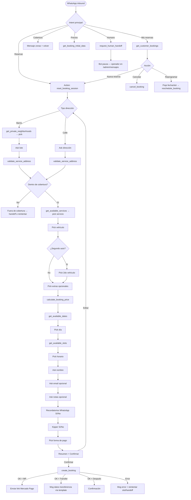

# WASHERO Botmaker WhatsApp Booking — Implementation Spec

> **Status:** Implemented in code (`botmaker-booking-tools` edge function). **Not deployed.**
>
> Architecture: WhatsApp → Botmaker deterministic flow → `botmaker-booking-tools` → `booking-core` → Supabase.

---

## 1. Audited Website Booking Flow (Address-First — live default)

The route `/reservar` renders `AddressFirstFlow` when `VITE_ADDRESS_FIRST_BOOKING=true` (current production default).

### Step 0 — Dirección

| Order | User action | Component | Validation | Next branch |
|-------|-------------|-----------|------------|-------------|
| 0.1 | Choose address mode | `AddressFirstFlow.switchAddressMode` | — | `street` or `private_neighborhood` |
| 0.2a | **Street:** Google Places autocomplete | `PlacesAutocomplete` | Must pick a suggestion (not free text) | → validate |
| 0.2b | **Private:** Search/select barrio + enter lote | `fetchPrivateNeighborhoods` + inputs | `private_neighborhood_id` + non-empty `private_lot` | → validate |
| 0.3 | Coverage validation | `validate-address-location` edge fn | `inside_coverage === true` | OK → Step 1; outside → block + WhatsApp CTA |
| 0.4 | Continue | `goToServiceStep()` | coverage `ok` + address ready | Step 1 |

**Coverage copy (website):** `COVERAGE_COPY` in `shared.ts` — Maschwitz, Escobar, Benavídez, Garín, Dique Luján, Tigre, Nordelta.

### Step 1 — Servicio

| Order | User action | Source | Validation |
|-------|-------------|--------|------------|
| 1.1 | Auto-select first service + vehicle | `useEffect` in `AddressFirstFlow` | — |
| 1.2 | Select service | `services` table | Required |
| 1.3 | Select vehicle size | `pricing_items` type=`vehicle_surcharge` | Required; maps `auto`→Auto, `suv`→SUV, `pickup`→Pick-up |
| 1.4 | Optional second vehicle | checkbox + second vehicle code | 20% discount on unit 2; extras only on unit 1 |
| 1.5 | Optional extras | `pricing_items` type=`extra` | Codes validated server-side |
| 1.6 | Client price estimate | `computeUnitPricing()` | **Display only** — server recalculates |
| 1.7 | Continue | `goToSlotsStep()` | service + vehicle (+ second if enabled) |

### Step 2 — Horario (logistic)

| Order | User action | Source | Validation |
|-------|-------------|--------|------------|
| 2.1 | Load availability | `get-logistic-availability` → `queryLogisticAvailabilityDays` | Requires lat/lng, service_id, booking_units |
| 2.2 | Filter lead time | `filterTooSoonSlots` (120 min) | Client + server |
| 2.3 | Pick day | recommended + other slots per day | Day must have slots |
| 2.4 | Pick slot | `{ date, time, slot_id }` | Required before Step 3 |
| 2.5 | Continue | `goToPaymentStep()` | slot selected |

**Recommended badge:** `score >= 70` (`RECOMMENDED_SCORE_MIN`).

### Step 3 — Datos y pago

| Field | Zod / client | Server (`tryCreateBooking`) |
|-------|--------------|----------------------------|
| `customer_name` | min 2 chars | non-empty trim |
| `customer_phone` | min 6, `^[+\d\s\-()]+$` | non-empty trim |
| `customer_email` | optional email | regex if present |
| `notes` | optional | merged into structured notes |
| `whatsapp_reminders` | checkbox → note text | not a DB column |
| `kipper_quote` | checkbox → note text | not a DB column |
| `payment_method` | MercadoPago / Transferencia / Pagar después | must match `PAYMENT_METHODS` |

**Submit:** `create-website-booking` → `tryCreateBooking` → `create_booking_atomic` RPC.

### Post-submit branches

| Payment | WhatsApp on create | Operator push | Customer next step |
|---------|-------------------|---------------|-------------------|
| MercadoPago | Deferred until paid | No | Redirect to MP checkout |
| Transferencia | Bank instructions template | No | WhatsApp transfer data |
| Pagar después | `booking_confirmed_v2` immediately | Yes | `/gracias` |

### Fields inserted into `bookings`

See `booking-core.ts` → `create_booking_atomic`. Key fields: customer, location (incl. `address_type`, private neighborhood, coverage), service, scheduling, pricing breakdown, marketing attribution, `booking_source=website`, `booking_status=pending` (inside coverage).

---

## 2. Website → Botmaker Field Mapping

| Website field / action | Website source | Supabase source | Botmaker variable | Botmaker question / action | API endpoint | Request schema (key fields) | Response schema (key fields) | Validation | Next branch |
|------------------------|----------------|-----------------|-------------------|------------------------------|--------------|----------------------------|------------------------------|------------|-------------|
| Main menu | `/reservar` entry | — | `intent_main` | Buttons: Reservar / Mis reservas / Cobertura / Precios / Humano | — | — | — | — | Sub-intent |
| Address mode | `switchAddressMode` | — | `address_mode` | Buttons: Calle / Barrio cerrado | — | — | — | — | Street vs private flow |
| Street address | `PlacesAutocomplete` | Google Places (client) | `address_query`, `place_id`, `formatted_address`, `address_lat`, `address_lng`, `neighborhood` | Ask: "¿Cuál es tu dirección?" (free text → manual geocode fallback) | `validate_service_address` | `{ address_type:"street", place_id?, formatted_address, address_lat, address_lng, neighborhood }` | `{ inside_coverage, coverage_zone_id, coverage_zone_name, match_type, customer_message? }` | Must be inside coverage | OK → service; outside → handoff or retry |
| Private neighborhood | `fetchPrivateNeighborhoods` | `private_neighborhoods` | `private_neighborhood_id`, `private_neighborhood_name` | List buttons from API | `get_private_neighborhoods` | `{ search? }` | `{ private_neighborhoods[] }` | Active row required | → ask lote |
| Private lot | `form.private_lot` | — | `private_lot` | Ask: "¿Lote o casa?" | `validate_service_address` | `{ address_type:"private_neighborhood", private_neighborhood_id, private_lot }` | `{ inside_coverage:true, display_address, address_lat, address_lng, ... }` | Non-empty lot | → service |
| Private extra details | `form.private_extra_details` | notes only | `private_extra_details` | Ask optional: "¿Algún detalle de ingreso?" | — | — | — | Optional | → service |
| Service | service cards | `services` | `service_id`, `service_name` | Buttons from API | `get_available_services` or `get_booking_initial_data` | `{}` | `{ services[] }` | active service | → vehicle |
| Vehicle | vehicle cards | `pricing_items` | `vehicle_code`, `vehicle_type` | Buttons: Auto / SUV / Pick-up | `get_booking_initial_data` | `{}` | `{ vehicles[] }` | maps to Auto/SUV/Pick-up | → second vehicle? |
| Second vehicle | checkbox | — | `second_vehicle_enabled`, `second_vehicle_code`, `second_vehicle_type` | Button: Sí / No → if sí, vehicle buttons | — | — | — | Max 2 units | → extras |
| Extras | checkboxes | `pricing_items` | `extras[]` (codes) | Multi-select buttons | `get_booking_initial_data` | `{}` | `{ extras[] }` | valid codes | → price calc |
| Price display | `computeUnitPricing` | server quote | `price_total`, `price_formatted` | Show summary (from API) | `calculate_booking_price` | `{ service_id, vehicle_type, selected_extras[], vehicle_count, second_vehicle_type? }` | `{ total_amount, formatted_total, breakdown }` | **Never trust client price** | → dates |
| Available days | calendar strip | logistic pipeline | `available_dates[]`, `selected_date` | Buttons per day | `get_available_dates` | `{ address_lat, address_lng, coverage_zone_id, service_id, booking_units[] }` | `{ dates[{date,label,slots_available,has_recommended}] }` | ≥120 min lead | → slots |
| Available slots | slot chips | logistic pipeline | `selected_slot_id`, `scheduled_date`, `scheduled_time` | Buttons (Recomendado first) | `get_available_slots` | `{ date, address_lat, address_lng, service_id, booking_units[] }` | `{ recommended_slots[], other_slots[] }` | slot exists + capacity | → contact |
| Customer name | input | — | `customer_name` | Ask | — | — | — | min 2 chars | → payment |
| Customer phone | input (web) / auto (WA) | — | `customer_phone` | Auto from WhatsApp; confirm if missing | — | — | — | min 6 digits | → payment |
| Customer email | input | — | `customer_email` | Ask optional | — | — | — | valid email or empty | → payment |
| Notes | textarea | — | `notes` | Ask optional | — | — | — | — | → flags |
| WhatsApp reminders | checkbox | notes | `whatsapp_reminders` | Button Sí/No | — | — | — | — | → kipper |
| Kipper quote | checkbox | notes | `kipper_quote` | Button Sí/No | — | — | — | — | → payment |
| Payment method | radio | — | `payment_method` | Buttons: MP / Transfer / Después | — | — | — | PAYMENT_METHODS | → confirm |
| Booking summary | review step | — | — | Text summary + Confirmar / Editar | — | — | — | — | → create |
| Create booking | `submit()` | `create_booking_atomic` | `confirmation_token` | Code Action on confirm | `create_booking` | Full payload (see §4) | `{ booking_id, status, checkout_url?, customer_message }` | All server validations | Success / error branches |
| List bookings | — | `bookings` | `bookings_list[]` | Show list + actions | `get_customer_bookings` | `{ limit? }` | `{ bookings[] }` | phone match | cancel/reschedule |
| Cancel | — | `cancel_booking_atomic` | `selected_booking_id` | Confirm cancel | `cancel_booking` | `{ booking_id }` | `{ ok, customer_message }` | ownership + status | done |
| Reschedule | — | `reschedule_booking_atomic` | `selected_booking_id`, new date/time | Re-use date/slot flow | `reschedule_booking` | `{ booking_id, new_date, new_time }` | `{ ok, customer_message }` | capacity re-check | done |
| Payment receipt | image/doc inbound | `payment_receipts` | — | Webhook auto-capture (existing) | — | — | — | Transferencia pending | admin review |
| Human handoff | WhatsApp link | `conversation_assignments` | `handoff_reason` | Code Action | `request_human_handoff` | `{ reason }` | `{ handoff:true, customer_message }` | — | stop bot |
| Session reset | — | — | all `bk_*` vars | Action: `reset_booking_session` | — | — | — | — | main menu |

### Shared request envelope (every Code Action)

```json
{
  "action": "<endpoint_name>",
  "conversation_id": "{{chatId}}",
  "platform_contact_id": "{{platformContactId}}",
  "customer_phone": "{{whatsappPhone}}",
  "is_test": false
}
```

**Headers:**
```
Content-Type: application/json
auth-bm-token: <BOTMAKER_BOOKING_TOOLS_SECRET>
```

**Endpoint URL:**
```
https://domslcbxgqbylmciqrxt.supabase.co/functions/v1/botmaker-booking-tools
```

---

## 3. Supabase Endpoints

| Action | Implementation | Reused modules |
|--------|----------------|----------------|
| `get_booking_initial_data` | `actionGetBookingInitialData` | `services`, `pricing_items` tables |
| `get_private_neighborhoods` | `actionGetPrivateNeighborhoods` | `private_neighborhoods` |
| `validate_service_address` | `actionValidateServiceAddress` | `coverage.ts`, `validate-address-location` logic |
| `get_available_services` | `actionGetAvailableServices` | `services` |
| `calculate_booking_price` | `actionCalculateBookingPrice` | `pricing-items.calculateBookingQuote` |
| `get_available_dates` | `actionGetAvailableDates` | `logistic-availability.queryLogisticAvailabilityDays` |
| `get_available_slots` | `actionGetAvailableSlots` | same + 120 min lead filter |
| `create_booking` | `actionCreateBooking` | `booking-core.tryCreateBooking`, MP + WhatsApp side effects |
| `get_customer_bookings` | `actionGetCustomerBookings` | `bookings` by phone |
| `cancel_booking` | `actionCancelBooking` | RPC `cancel_booking_atomic` |
| `reschedule_booking` | `actionRescheduleBooking` | RPC `reschedule_booking_atomic` |
| `request_human_handoff` | `actionRequestHumanHandoff` | `conversation_assignments` |

**Files:**
- `supabase/functions/botmaker-booking-tools/index.ts` — HTTP router
- `supabase/functions/_shared/botmaker-booking-tools.ts` — business logic

---

## 4. Botmaker Variables (prefix `bk_`)

| Variable | Type | Set by | Cleared by `reset_booking_session` |
|----------|------|--------|-----------------------------------|
| `bk_session_id` | string (UUID) | flow start | yes |
| `bk_flow` | string | intent router | yes |
| `bk_address_mode` | street \| private_neighborhood | user | yes |
| `bk_place_id` | string | street validate | yes |
| `bk_formatted_address` | string | street validate | yes |
| `bk_address` | string | validate / display | yes |
| `bk_address_lat` | number | validate | yes |
| `bk_address_lng` | number | validate | yes |
| `bk_neighborhood` | string | validate | yes |
| `bk_coverage_zone_id` | string | validate | yes |
| `bk_coverage_zone_name` | string | validate | yes |
| `bk_inside_coverage` | boolean | validate | yes |
| `bk_private_neighborhood_id` | string | private pick | yes |
| `bk_private_neighborhood_name` | string | private pick | yes |
| `bk_private_lot` | string | user input | yes |
| `bk_private_extra_details` | string | user input | yes |
| `bk_service_id` | string | service pick | yes |
| `bk_service_name` | string | service pick | yes |
| `bk_vehicle_code` | auto/suv/pickup | vehicle pick | yes |
| `bk_vehicle_type` | Auto/SUV/Pick-up | mapped | yes |
| `bk_second_vehicle_enabled` | boolean | user | yes |
| `bk_second_vehicle_code` | string | user | yes |
| `bk_second_vehicle_type` | string | mapped | yes |
| `bk_extras` | JSON array of codes | user | yes |
| `bk_vehicle_count` | 1 or 2 | derived | yes |
| `bk_price_total` | number | **API only** | yes |
| `bk_price_formatted` | string | **API only** | yes |
| `bk_duration_minutes` | number | API | yes |
| `bk_selected_date` | YYYY-MM-DD | user | yes |
| `bk_selected_time` | HH:MM | user | yes |
| `bk_selected_slot_id` | string | user | yes |
| `bk_customer_name` | string | user | yes |
| `bk_customer_email` | string | user | yes |
| `bk_notes` | string | user | yes |
| `bk_whatsapp_reminders` | boolean | user | yes |
| `bk_kipper_quote` | boolean | user | yes |
| `bk_payment_method` | string | user | yes |
| `bk_confirmation_token` | string | message id / timestamp | yes |
| `bk_booking_id` | string | create_booking | yes |
| `bk_checkout_url` | string | create_booking (MP) | yes |
| `bk_last_api_error` | string | any API fail | yes |
| `bk_selected_booking_id` | string | manage flow | yes (manage only) |
| `bk_handoff_active` | boolean | handoff | no (separate reset) |

**Platform variables (Botmaker built-in — do not overwrite):**
- `{{chatId}}` → `conversation_id`
- `{{platformContactId}}` → may be BSUID (non-numeric) or phone
- `{{whatsappPhone}}` / `{{realWhatsAppId}}` → `customer_phone`

---

## 5. Flow Diagram



---

## 6. Dashboard Construction Steps (Botmaker)

### 6.1 Secrets & Code Action template

1. Supabase secret: `BOTMAKER_BOOKING_TOOLS_SECRET=<random>` (or reuse `BOTMAKER_WEBHOOK_SECRET`).
2. Create **Code Action** template `CA_WASHERO_API`:
   - Method: POST
   - URL: `https://domslcbxgqbylmciqrxt.supabase.co/functions/v1/botmaker-booking-tools`
   - Header `auth-bm-token`: your secret
   - Body: JSON with `action` + context fields
   - Parse response JSON into variables (Botmaker "save response fields").

### 6.2 Global Action: `reset_booking_session`

Create a **Set Variables** action clearing all `bk_*` variables listed in §4. Also set `bk_session_id = {{$uuid}}`.

Trigger: start of "Nueva reserva", after successful booking, on keyword "empezar de nuevo" / "cancelar reserva" (new booking intent).

### 6.3 Intent: `intent_main_menu`

**Trigger:** default / keywords: `hola`, `menu`, `washero`, `lavado`, `reservar`

**Message:**
```
¡Hola! 👋 Soy el asistente de Washero.
¿En qué te puedo ayudar hoy?
```

**Buttons:**
| Label | Next intent |
|-------|-------------|
| 🚗 Reservar lavado | `intent_new_booking_start` |
| 📋 Mis reservas | `intent_my_bookings` |
| 📍 ¿Llegan a mi zona? | `intent_coverage_info` |
| 💰 Servicios y precios | `intent_services_prices` |
| 🙋 Hablar con alguien | `intent_human_handoff` |

### 6.4 Intent: `intent_new_booking_start`

1. Action: `reset_booking_session`
2. Message:
```
Perfecto, arrancamos tu reserva 🚗✨
¿Tu auto está en una dirección a la calle o en un barrio cerrado/country?
```
3. Buttons: `Dirección a la calle` → `intent_address_street` | `Barrio cerrado` → `intent_address_private`

### 6.5 Intent: `intent_address_street`

1. Ask (free text): `¿Cuál es tu dirección? Incluí calle y localidad. Ej: Av. del Libertador 1234, Tigre`
2. Code Action `CA_validate_street` → `validate_service_address` with geocoded lat/lng if available from Botmaker location, else neighborhood-only fallback.
3. Branch on `inside_coverage`.

**Success:**
```
¡Genial! Estás en {{bk_coverage_zone_name}} ✅
```
→ `intent_pick_service`

**Outside coverage:**
```
Uy, por ahora no llegamos a esa zona 😔
{{coverage_copy}}
```
Buttons: `Probar otra dirección` | `Hablar con alguien`

### 6.6 Intent: `intent_address_private`

1. Code Action `CA_list_neighborhoods` → `get_private_neighborhoods`
2. Dynamic buttons from `private_neighborhoods[].name` (paginate if >3).
3. Ask: `¿Cuál es tu lote o número de casa?`
4. Code Action `CA_validate_private` → `validate_service_address`
5. → `intent_pick_service`

### 6.7 Intent: `intent_pick_service`

1. Code Action `CA_services` → `get_available_services` (or use cached from initial data).
2. Buttons per service with name + `desde $X`.
3. → `intent_pick_vehicle`

### 6.8 Intent: `intent_pick_vehicle`

Buttons: `Auto` | `SUV` | `Pick-up` (+ amount suffix from variables)

Ask: `¿Querés agregar un segundo vehículo con 20% OFF? 🎉`
Buttons: `Sí, agregar` | `No, continuar`

If yes → second vehicle buttons (extras **not** applied to unit 2 — same as website).

→ `intent_pick_extras`

### 6.9 Intent: `intent_pick_extras`

Message:
```
¿Querés sumar algún extra? (opcional)
```
Multi-select or numbered list from API extras. Include button `Sin extras`.

→ Code Action `CA_price` → `calculate_booking_price`

Show:
```
Tu estimado: {{bk_price_formatted}} 💰
(incluye servicio + vehículo{{#bk_second_vehicle_enabled}} + 2do auto con 20% OFF{{/bk_second_vehicle_enabled}})
```
→ `intent_pick_date`

### 6.10 Intent: `intent_pick_date`

Code Action `CA_dates` → `get_available_dates`

Message: `¿Qué día te queda mejor?`
Buttons: one per available date using `label`.

→ `intent_pick_slot`

### 6.11 Intent: `intent_pick_slot`

Code Action `CA_slots` → `get_available_slots` with `date={{bk_selected_date}}`

Show recommended slots first:
```
⭐ Recomendados para tu zona:
```
Then optional "Ver más horarios".

→ `intent_contact_name`

### 6.12 Intent: `intent_contact_name`

Ask: `¿A nombre de quién hacemos la reserva?`
Validate: length ≥ 2 else reprompt.

→ Ask email (optional): `¿Tenés email para la factura? (opcional, escribí "no" para saltear)`

→ Ask notes (optional)

→ WhatsApp reminders Sí/No

→ Kipper quote Sí/No

→ `intent_pick_payment`

### 6.13 Intent: `intent_pick_payment`

```
¿Cómo preferís pagar?
```
Buttons: `Mercado Pago` | `Transferencia` | `Pagar después`

→ `intent_confirm_booking`

### 6.14 Intent: `intent_confirm_booking`

Summary message:
```
📋 *Resumen de tu reserva*

📍 {{bk_address}}
🧼 {{bk_service_name}} · {{bk_vehicle_type}}{{#bk_second_vehicle_enabled}} + {{bk_second_vehicle_type}}{{/bk_second_vehicle_enabled}}
📅 {{bk_selected_date}} a las {{bk_selected_time}}
💰 {{bk_price_formatted}}
💳 {{bk_payment_method}}
👤 {{bk_customer_name}}

¿Confirmás que está todo bien?
```

Buttons: `✅ Confirmar` | `✏️ Empezar de nuevo`

On confirm:
- Set `bk_confirmation_token = {{messageId}}`
- Code Action `CA_create_booking` → `create_booking`

**Success branches:** see §8 copy.

### 6.15 Intent: `intent_my_bookings`

Code Action → `get_customer_bookings`

If empty:
```
No encontramos reservas con este WhatsApp.
¿Querés hacer una nueva?
```

If bookings: list with buttons `Cancelar #N` / `Reprogramar #N`.

### 6.16 Intent: `intent_coverage_info`

Code Action → `get_booking_initial_data` (for `coverage_copy`)

Message:
```
📍 *Zona de cobertura Washero*

{{coverage_copy}}

Si querés, probamos tu dirección ahora mismo con una reserva.
```

### 6.17 Intent: `intent_services_prices`

Code Action → `get_booking_initial_data`

List services + base prices + vehicle surcharges. **Do not invent prices.**

### 6.18 Intent: `intent_human_handoff`

Code Action → `request_human_handoff` with reason from context.

Set `bk_handoff_active = true`. Pause bot rules.

### 6.19 Session expiry

After **30 minutes** idle during an in-progress booking (`bk_session_id` set):
```
Pasó un while sin actividad y liberamos tu turno en curso ⏱️
Si querés reservar, tocá *Reservar lavado*.
```
Actions: `reset_booking_session` → `intent_main_menu`

---

## 7. Exact Customer Copy (Rioplatense Spanish)

### Main menu
```
¡Hola! 👋 Soy el asistente de Washero.
¿En qué te puedo ayudar hoy?
```

### Address mode
```
Perfecto, arrancamos tu reserva 🚗✨
¿Tu auto está en una dirección a la calle o en un barrio cerrado/country?
```

### Street address ask
```
¿Cuál es tu dirección? Incluí calle y localidad.
Ej: Av. del Libertador 1234, Tigre
```

### Private lot ask
```
¿Cuál es tu lote o número de casa dentro del barrio?
```

### Coverage OK
```
¡Genial! Estás en {{bk_coverage_zone_name}} ✅
```

### Coverage fail
```
Uy, por ahora no llegamos a esa zona 😔

Por ahora Washero trabaja en Maschwitz, Escobar, Benavídez, Garín, Dique Luján, Tigre y Nordelta.

¿Querés probar con otra dirección o hablar con el equipo?
```

### Second vehicle
```
¿Querés agregar un segundo vehículo con 20% OFF? 🎉
```

### Extras
```
¿Querés sumar algún extra? (opcional)
Podés elegir varios o continuar sin extras.
```

### Price
```
Tu estimado: {{bk_price_formatted}} 💰
El precio final lo confirma el sistema al reservar.
```

### Dates empty
```
No hay turnos disponibles para tu zona en los próximos días 😕
¿Querés probar otro servicio o hablar con alguien del equipo?
```

### Slot pick
```
⭐ Horarios recomendados para el {{bk_selected_date}}:
```

### Name invalid
```
El nombre es muy corto. Ingresalo completo (mínimo 2 letras).
```

### Email invalid
```
Ese email no parece válido. Probá de nuevo o escribí "no" para saltear.
```

### Payment pick
```
¿Cómo preferís pagar?
• Mercado Pago — link online
• Transferencia — te pasamos CBU/alias
• Pagar después — en el lugar
```

### Confirm summary
(See §6.14)

### Booking success — Pagar después
```
¡Listo! 🚗✨ Reserva confirmada.

📅 {{bk_selected_date}} {{bk_selected_time}}
📍 {{bk_address}}
💰 {{bk_price_formatted}}

Te escribimos por WhatsApp con los detalles. ¡Gracias!
```

### Booking success — Mercado Pago
```
¡Reserva registrada! 🙌
Para confirmarla, pagá acá:
{{bk_checkout_url}}

Si el link no abre, escribinos y te ayudamos.
```

### Booking success — Transferencia
```
¡Reserva registrada! 🙌
Te enviamos por WhatsApp los datos para transferir.

Cuando pagues, mandanos el comprobante por acá 📎
```

### API error — slot full
```
Ese horario se ocupó recién 😅
Elegí otro horario disponible.
```

### API error — duplicate
```
Ya tenemos una reserva tuya para ese día y horario.
¿Querés ver tus reservas o elegir otro horario?
```

### Cancel confirm
```
¿Seguro que querés cancelar esta reserva?
📅 {{scheduled_date}} {{scheduled_time}} — {{service_name}}
```
Buttons: `Sí, cancelar` | `No, volver`

### Cancel success
```
Listo, cancelamos tu reserva. Si querés reagendar, avisanos 💪
```

### Reschedule success
```
Perfecto, reprogramamos tu lavado ✅
Nuevo horario: {{scheduled_date}} {{scheduled_time}}
```

### Human handoff
```
Te derivamos con el equipo de Washero 🙌
En breve te responde una persona.
```

### Session expired
```
Pasó un while sin actividad y liberamos tu turno en curso ⏱️
Si querés reservar, tocá *Reservar lavado*.
```

### Payment receipt received (existing webhook)
```
Recibimos tu comprobante 📎 Lo revisa el equipo y te confirmamos a la brevedad.
```

---

## 8. Test Scenarios

| # | Scenario | Steps | Expected |
|---|----------|-------|----------|
| 1 | Happy path street | Calle → valid address → básico → auto → no 2do → sin extras → date → slot → name → MP confirm | `create_booking` ok, `checkout_url` present |
| 2 | Private neighborhood | Barrio → pick Nordelta country → lote 45 → completo → SUV | `validate` inside_coverage, display address with lote |
| 3 | Second vehicle discount | 2 vehicles same service | `calculate_booking_price` shows 20% on unit 2 |
| 4 | Outside coverage | Invalid address | `inside_coverage:false`, no slot offer, handoff offered |
| 5 | Slot too soon | Pick slot <120 min | Filtered from lists; `create_booking` returns slot_too_soon if forced |
| 6 | Slot full race | Two concurrent creates same slot | Second gets `slot_full` 409 |
| 7 | Duplicate phone | Same phone+date+time | `duplicate` 409 |
| 8 | Idempotent confirm | Double-tap Confirmar | Same `booking_id` (idempotency key) |
| 9 | BSUID contact | platformContactId non-numeric | Phone from `customer_phone`/`realWhatsAppId`; bookings tied correctly |
| 10 | Manage — list | Existing customer | `get_customer_bookings` returns rows |
| 11 | Cancel | Cancel pending booking | `cancel_booking_atomic` ok |
| 12 | Reschedule | New date/slot with capacity | `reschedule_booking_atomic` ok |
| 13 | Transfer + receipt | Transfer booking → send image | Webhook captures receipt (existing flow) |
| 14 | Session reset | Start booking, abandon, restart | No stale `bk_service_id` / price in new flow |
| 15 | Human handoff | Ask for human mid-flow | `conversation_assignments` open, bot pauses |
| 16 | API auth fail | Wrong secret | 401 unauthorized |
| 17 | Invalid extra code | Tampered extras in request | `invalid_extra` |
| 18 | Price tamper | Send wrong `price_total` in body | Ignored — server recalculates |

---

## 9. Manual Configuration Checklist

### Supabase (before deploy)
- [ ] `supabase secrets set BOTMAKER_BOOKING_TOOLS_SECRET=...`
- [ ] Deploy function: `supabase functions deploy botmaker-booking-tools` (**when ready — not now**)
- [ ] Verify existing secrets: `MERCADOPAGO_ACCESS_TOKEN`, transfer bank vars, `BOTMAKER_API_TOKEN`

### Botmaker dashboard
- [ ] Create Code Action template with auth header
- [ ] Map response JSON paths to `bk_*` variables
- [ ] Build intents per §6 with exact button labels
- [ ] Add `reset_booking_session` action on all `bk_*` variables
- [ ] Configure 30-min idle timeout → session expired message + reset
- [ ] Disable / do not deploy Anthropic orchestrator, `whatsapp-agent-worker`, or LLM pipeline
- [ ] Pause conflicting legacy summary-parser auto-booking rules if they duplicate `create_booking`
- [ ] Configure handoff: assign queue to operators, pause bot on `bk_handoff_active`
- [ ] WhatsApp channel: ensure `{{platformContactId}}` and `{{whatsappPhone}}` mapped in Code Actions
- [ ] Test mode: pass `"is_test": true` → bookings tagged `[TEST]` in notes

### Do NOT configure
- ❌ Anthropic API / `WHATSAPP_AGENT_MODE=active`
- ❌ LLM intent classification for booking steps

---

## 10. Deliberate Differences: Website vs WhatsApp

| Aspect | Website | WhatsApp (Botmaker) | Reason |
|--------|---------|---------------------|--------|
| Address input (street) | Google Places autocomplete (required) | Free-text + validate API | WhatsApp has no Places widget; may use location share or geocode |
| Phone collection | Manual input required | Auto from WhatsApp | Platform provides identity |
| Availability UI | Calendar + logistic chips | Button lists (3-day pages) | WhatsApp button limits (max 3 buttons per message — use numbered lists or pagination) |
| MercadoPago | Browser redirect | Link in chat message | No in-chat browser redirect |
| `booking_status` on create | `pending` | `confirmed` (existing `booking-core` rule for `source=botmaker`) | Historical Botmaker bookings auto-confirm |
| Marketing attribution | UTM/QR/gclid captured | Not collected | No landing URL in WhatsApp |
| Email | Optional field | Optional ask | Same |
| Confirmation UX | `/gracias` page | WhatsApp messages + templates | Channel constraint |
| Payment receipt | N/A on web form | Inbound image via existing webhook | Transferencia flow |
| Session state | React component state | Botmaker variables + reset action | Must prevent stale variable contamination |
| Price display timing | Live recalc on each change | Recalc at extras + before confirm | Reduce API calls; always recalc on `create_booking` |

---

## Appendix: `create_booking` request schema

```json
{
  "action": "create_booking",
  "conversation_id": "chat-abc",
  "platform_contact_id": "bsuid:xxx",
  "customer_phone": "5491176247835",
  "confirmation_token": "msg-12345",
  "customer_name": "Juan Pérez",
  "customer_email": "juan@email.com",
  "address_type": "street",
  "address": "Av. del Libertador 1234, Tigre",
  "formatted_address": "Av. del Libertador 1234, Tigre, Argentina",
  "place_id": "ChIJ...",
  "address_lat": -34.412,
  "address_lng": -58.589,
  "neighborhood": "Tigre",
  "service_id": "uuid",
  "vehicle_type": "SUV",
  "vehicle_code": "suv",
  "selected_extras": ["encerrado_rapido"],
  "second_vehicle_enabled": false,
  "booking_units": [
    { "vehicle_type": "SUV", "service_id": "uuid", "selected_extras": ["encerrado_rapido"] }
  ],
  "scheduled_date": "2026-08-05",
  "scheduled_time": "10:00",
  "payment_method": "MercadoPago",
  "notes": "",
  "whatsapp_reminders": true,
  "kipper_quote": false,
  "private_neighborhood_id": null,
  "private_lot": null,
  "private_extra_details": null
}
```

**Response (success):**
```json
{
  "action": "create_booking",
  "ok": true,
  "status": "booking_created_payment_pending",
  "booking_id": "uuid",
  "booking_status": "confirmed",
  "payment_status": "pending",
  "checkout_url": "https://www.mercadopago.com.ar/...",
  "summary": { "service_name": "...", "price": 45000, "..." },
  "customer_message": "Reserva recibida. Pagá acá: ..."
}
```
